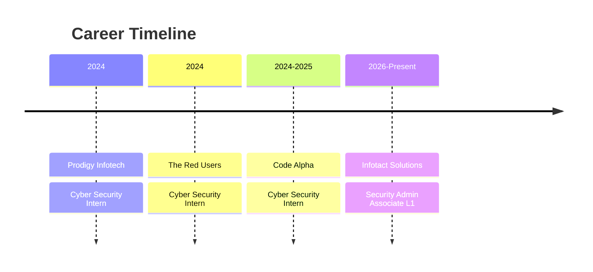

<!-- PROFILE HEADER -->

<p align="center">
  
</p>

<h1 align="center">Hi 👋 I'm Gaurav Bhattacharjee</h1>

<h3 align="center">
  Cybersecurity Researcher • Penetration Tester • Vulnerability Researcher
</h3>

<p align="center">
  <a href="https://github.com/0xgh057r3c0n">
    
  </a>
  
  
  
</p>

<p align="center">
  
</p>

## 🚀 About Me

I'm a cybersecurity researcher and penetration tester focused on discovering, understanding, and responsibly demonstrating security vulnerabilities in modern applications and infrastructure.

My primary areas of interest include **Web Application Security, API Security, Android Security, AI/LLM Security, Vulnerability Research, and Security Automation**.

```yaml
Role:
  - Cybersecurity Researcher
  - Penetration Tester
  - Vulnerability Researcher

Focus:
  - Web Application Security
  - API Security
  - Android Security
  - AI / LLM Security
  - Vulnerability Research
  - Security Automation
  - Secure Software Engineering
  - DevSecOps

Research:
  - CVE Analysis
  - Proof-of-Concept Development
  - Security Tooling
  - Automated Vulnerability Detection
```

---

## 🛡️ Security Focus Areas

| Area                      | Focus                                                                                 |
| ------------------------- | ------------------------------------------------------------------------------------- |
| 🌐 Web Security           | Application vulnerabilities, authentication, authorization, injection, business logic |
| 🔌 API Security           | BOLA, BFLA, authorization, JWT, rate limiting, endpoint abuse                         |
| 📱 Android Security       | Static analysis, dynamic analysis, reverse engineering, IPC, WebView                  |
| 🤖 AI / LLM Security      | Prompt injection, RAG security, agent security, tool-calling risks                    |
| 🔬 Vulnerability Research | CVE analysis, root-cause analysis, exploitability research                            |
| ⚙️ Security Automation    | Python tooling, scanners, automation and security pipelines                           |
| ☁️ DevSecOps              | CI/CD security, RBAC, secure deployment and automation                                |

---

## 🔍 Technical Skills

<details>
<summary><b>🌐 Web Application Security</b></summary>

`SQL Injection` · `NoSQL Injection` · `Command Injection` · `XPath Injection` · `XSS` · `CSRF` · `XXE` · `SSRF` · `IDOR` · `BOLA` · `HTTP Request Smuggling` · `HTTP Parameter Pollution` · `Host Header Injection` · `RCE` · `Path Traversal` · `Open Redirect` · `HTML Injection` · `Template Injection` · `Prototype Pollution` · `Cache Poisoning` · `Clickjacking` · `CORS Misconfiguration` · `JWT Manipulation` · `Session Fixation` · `Authentication Bypass` · `Privilege Escalation` · `Mass Assignment` · `Business Logic Flaws` · `WAF Evasion Testing`

</details>

<details>
<summary><b>🔌 API Security</b></summary>

`BOLA` · `BFLA` · `IDOR` · `Mass Assignment` · `Broken Authentication` · `JWT Security` · `Rate Limit Testing` · `Business Logic Testing` · `CORS Testing` · `Endpoint Enumeration` · `API Abuse` · `Authorization Testing`

</details>

<details>
<summary><b>📱 Android Security</b></summary>

`Static Analysis` · `Dynamic Analysis` · `Local Storage Analysis` · `IPC Testing` · `Network Security Testing` · `Reverse Engineering` · `Frida Hooking` · `WebView Security` · `Root Detection Analysis` · `Binary Analysis` · `APK Analysis`

</details>

<details>
<summary><b>🤖 AI / LLM Security</b></summary>

`Prompt Injection` · `Indirect Prompt Injection` · `Jailbreak Testing` · `System Prompt Leakage` · `Prompt Leakage` · `Hallucination Testing` · `RAG Security` · `Tool Calling Security` · `AI Agent Security` · `LLM Application Security` · `OWASP LLM Top 10`

</details>

<details>
<summary><b>🔬 Vulnerability Research</b></summary>

`CVE Analysis` · `Root Cause Analysis` · `Patch Analysis` · `PoC Development` · `Exploitability Assessment` · `Vulnerability Validation` · `Security Advisory Research`

</details>

---

## ⚙️ Technologies & Tools

### Languages & Platforms

<p align="center">
  
</p>

### Security Tooling

<p align="center">
  
  
  
  
  
  
  
  
  
  
</p>

---

## 🏆 GitHub Trophies

<p align="center">
  
</p>

---

## 📊 GitHub Analytics

<p align="center">
  


</p>

<p align="center">
  
</p>

---

## 🐍 Contribution Snake

<picture>
  <source
    media="(prefers-color-scheme: dark)"
    srcset="https://raw.githubusercontent.com/0xgh057r3c0n/0xgh057r3c0n/output/github-contribution-grid-snake-dark.svg"
  />
  <source
    media="(prefers-color-scheme: light)"
    srcset="https://raw.githubusercontent.com/0xgh057r3c0n/0xgh057r3c0n/output/github-contribution-grid-snake.svg"
  />
  
</picture>

---

## 🚀 Public CVE Research

| CVE ID                                                            | Research Area                             | Severity    |
| ----------------------------------------------------------------- | ----------------------------------------- | ----------- |
| [CVE-2025-25257](https://nvd.nist.gov/vuln/detail/CVE-2025-25257) | FortiWeb SQL Injection → RCE              | 🔴 Critical |
| [CVE-2025-3102](https://nvd.nist.gov/vuln/detail/CVE-2025-3102)   | SureTriggers Authorization Bypass         | 🟠 High     |
| [CVE-2025-31125](https://nvd.nist.gov/vuln/detail/CVE-2025-31125) | Vite WASM Path Traversal                  | 🟠 High     |
| [CVE-2025-31161](https://nvd.nist.gov/vuln/detail/CVE-2025-31161) | CrushFTP Authentication Bypass            | 🔴 Critical |
| [CVE-2025-3248](https://nvd.nist.gov/vuln/detail/CVE-2025-3248)   | Langflow AI RCE                           | 🔴 Critical |
| [CVE-2025-34077](https://nvd.nist.gov/vuln/detail/CVE-2025-34077) | Pie Register Admin Session Hijack         | 🟠 High     |
| [CVE-2025-34085](https://nvd.nist.gov/vuln/detail/CVE-2025-34085) | Simple File List Plugin RCE               | 🔴 Critical |
| [CVE-2025-47812](https://nvd.nist.gov/vuln/detail/CVE-2025-47812) | Wing FTP Server Lua Injection RCE         | 🔴 Critical |
| [CVE-2025-48827](https://nvd.nist.gov/vuln/detail/CVE-2025-48827) | vBulletin Critical API Access             | 🔴 Critical |
| [CVE-2025-5777](https://nvd.nist.gov/vuln/detail/CVE-2025-5777)   | Citrix NetScaler Memory Leak              | 🟡 Medium   |
| [CVE-2025-6058](https://nvd.nist.gov/vuln/detail/CVE-2025-6058)   | WPBlock Unauthenticated File Upload → RCE | 🔴 Critical |

📂 **Research & PoCs:**
https://github.com/0xgh057r3c0n

---

## 📝 Technical Publications

<p>
  <a href="https://medium.com/@gauravbhattacharjee54">
    
  </a>
</p>

### 🔬 Obfuscate

**A Powerful Tool for Bypassing Web Application Firewalls (WAFs) Using Obfuscation**

📅 August 2025

[Read the article →](https://medium.com/@gauravbhattacharjee54)

---

## 💼 Professional Experience



### 🛡️ Security Admin Associate L1 — Infotact Solutions

**Jun 2026 – Present**

* Developing secure OTA firmware update and code-signing infrastructure
* Building an AI-powered PHI/PII redaction pipeline for LLM applications
* Engineering a SOAR-based incident containment engine
* Implementing secure CI/CD pipelines
* Working with GitHub Actions and RBAC
* Applying security engineering principles to real-world systems

### 🔒 Cyber Security Intern — Code Alpha

**Nov 2024 – Feb 2025**

* Built a bug bounty platform
* Developed a packet sniffer using Scapy
* Developed a secure file-transfer system with encryption
* Created Streamlit dashboards for security visibility
* Received a Letter of Recommendation

### 🛡️ Cyber Security Intern — The Red Users

**Oct 2024 – Nov 2024**

* Network traffic monitoring
* Threat investigation
* Vulnerability assessment
* Security analysis

### 🔑 Cyber Security Intern — Prodigy Infotech

**Nov 2024**

* Developed a Caesar Cipher implementation
* Built image encryption projects
* Developed a password strength checker
* Built a packet analyzer

---

## 🎓 Certifications & Education

### Certifications

<p align="left">
  
  
  
  
</p>

### Education

* **National Institute of Open Schooling** — Secondary Education
* **Bongaigaon College** — Higher Secondary, Fine Arts

---

## 🌐 Connect With Me

<p align="left">
  <a href="mailto:gauravbhattacharjee54@gmail.com">
    
  </a>

  <a href="https://www.linkedin.com/in/gaurav-bhattacharjee/">
    
  </a>

  <a href="https://github.com/0xgh057r3c0n">
    
  </a>

  <a href="https://0xgh057r3c0n.github.io/">
    
  </a>

  <a href="https://medium.com/@gauravbhattacharjee54">
    
  </a>
</p>

---

## 🌍 Languages

| Language      | Proficiency |
| ------------- | ----------- |
| 🇬🇧 English  | Fluent      |
| 🇮🇳 Hindi    | Fluent      |
| 🇮🇳 Bengali  | Fluent      |
| 🇮🇳 Assamese | Fluent      |

---

## 👀 Profile Statistics

<p align="center">
  


</p>

---

## ☕ Support My Work

<p align="left">
  <a href="https://buymeacoffee.com/gauravbhaty">
    
  </a>

  <a href="https://ko-fi.com/0xgh057r3c0n">
    
  </a>
</p>

---

<p align="center">
  
</p>

<h3 align="center">
  🔐 Security isn't just about finding vulnerabilities — it's about understanding, fixing, and preventing them.
</h3>

<p align="center">
  <b>⭐ If you find my research useful, consider starring the repositories! ⭐</b>
</p>
