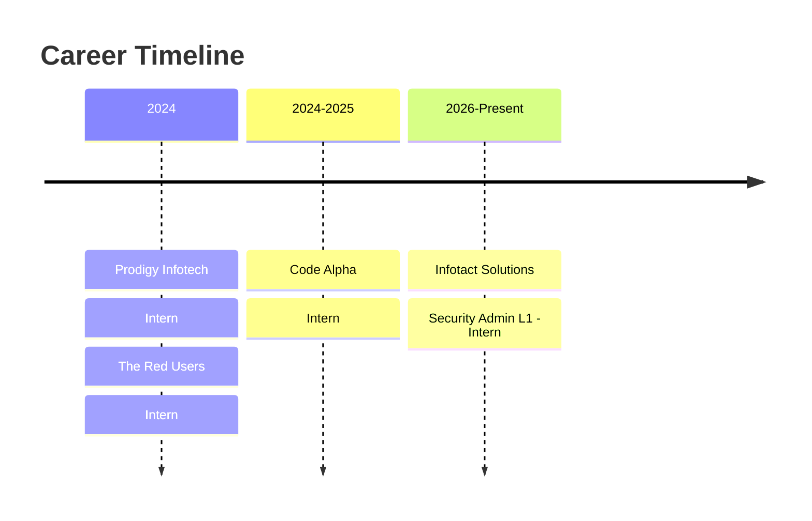

<!-- PROFILE PICTURE & HEADER -->
<p align="center">
  
</p>

<h1 align="center">Hi 👋 I'm Gaurav Bhattacharjee</h1>
<h3 align="center">Penetration Tester</h3>

<p align="center">
  
  
  
</p>

---

<!-- FANCY DIVIDER -->
<p align="center">
  
</p>

### 🚀 About Me

Cybersecurity enthusiast with **2+ years of field expertise** focused on Web Application Security, API Security Testing, Android Pentesting, **AI/LLM Security**, and Vulnerability Research. Adept at utilizing advanced tools and techniques to identify and address security vulnerabilities effectively.

```yaml
🔐 Web Application Security Researcher
📱 Android Application Pentester
🛡️ API Security Tester
🤖 AI/LLM Security Enthusiast
🧠 OSINT & Automation Enthusiast
⚔️ CVE PoC Developer
🏗️ Secure Software Engineering & DevOps
```

---

### 🛡️ Skill Proficiency Levels

| Category | Skill Level |
|----------|-------------|
| **Web App Security** | ████████████████████░ 95% |
| **API Security** | ██████████████████░░░ 90% |
| **Android Pentesting** | ████████████████░░░░░ 80% |
| **AI / LLM Security** | ████████████████░░░░░ 80% |
| **Cloud / DevOps Sec** | ███████████████░░░░░░ 75% |
| **OSINT & Automation** | █████████████████░░░░ 85% |

---

### 🛠️ Technical Skills (Expanded)

<details>
<summary><b>🔍 Web Application Security</b> (Click to expand)</summary>

`SQLi` · `NoSQLi` · `Command Injection` · `XPath Injection` · `XSS` · `CSRF` · `XXE` · `SSRF` · `IDOR` · `HTTP Request Smuggling` · `HTTP Parameter Pollution` · `Host Header Injection` · `RCE` · `Path Traversal` · `Open Redirect` · `HTML Injection` · `Template Injection` · `Prototype Pollution` · `Cache Poisoning` · `Clickjacking` · `CORS Misconfiguration` · `JWT Manipulation` · `Session Fixation` · `Authentication Bypass` · `Privilege Escalation` · `Mass Assignment` · `Business Logic Flaws` · `WAF Bypassing`
</details>

<details>
<summary><b>🔌 API Security</b> (Click to expand)</summary>

`BOLA` · `BFLA` · `Mass Assignment` · `SSPP` · `IDOR` · `Rate Limit Bypass` · `Business Logic Flaws` · `CORS Misconfiguration` · `JWT Tampering` · `Endpoint Abuse` · `API Enumeration`
</details>

<details>
<summary><b>📱 Android Pentesting</b> (Click to expand)</summary>

`Static Analysis` · `Dynamic Analysis` · `Local Storage Vulnerabilities` · `IPC Attacks` · `Network Testing` · `Reverse Engineering` · `Frida Hooking` · `WebView Attacks` · `Root Detection Bypass` · `Binary Protections`
</details>

<details>
<summary><b>🤖 AI / LLM Security</b> (Click to expand)</summary>

`Prompt Injection` · `Indirect Prompt Injection` · `Jailbreak Testing` · `System Prompt Extraction` · `Prompt Leakage` · `Hallucination Testing` · `RAG Security` · `Tool Calling Security` · `AI Agent Security` · `OWASP LLM Top 10`
</details>

---

### ⚙️ Tech Stack & Tools

<p align="center">
  
</p>

<p align="center">
  <!-- Security Tools Badges -->
  
  
  
  
  
  
  
  
  
  
</p>

---

### 🏆 GitHub Trophies

<p align="center">
  
</p>

---

### 📊 GitHub Analytics

<p align="center">
  
  
</p>

<p align="center">
  
  
</p>

---

### 🐍 Contribution Snake

<picture>
  <source media="(prefers-color-scheme: dark)" srcset="https://raw.githubusercontent.com/0xgh057r3c0n/0xgh057r3c0n/output/github-contribution-grid-snake-dark.svg" />
  <source media="(prefers-color-scheme: light)" srcset="https://raw.githubusercontent.com/0xgh057r3c0n/0xgh057r3c0n/output/github-contribution-grid-snake.svg" />
  
</picture>

> *Note: To enable the snake, create a GitHub Action workflow or manually generate it using [Platane/snk](https://github.com/Platane/snk).*

---

### 🚀 Public CVE Research

| CVE ID | Description | Severity |
|--------|-------------|----------|
| CVE-2025-25257 | FortiWeb SQL Injection → RCE |  |
| CVE-2025-3102 | SureTriggers Authorization Bypass |  |
| CVE-2025-31125 | Vite WASM Path Traversal |  |
| CVE-2025-31161 | CrushFTP Authentication Bypass |  |
| CVE-2025-3248 | Langflow AI RCE |  |
| CVE-2025-34077 | Pie Register Admin Session Hijack |  |
| CVE-2025-34085 | Simple File List Plugin RCE |  |
| CVE-2025-47812 | Wing FTP Server Lua Injection RCE |  |
| CVE-2025-48827 | vBulletin Critical API Access |  |
| CVE-2025-5777 | Citrix NetScaler Memory Leak |  |
| CVE-2025-6058 | WPBlock Plugin Unauthenticated File Upload → RCE |  |

📂 **All PoCs available:** [GitHub Repository](https://github.com/0xgh057r3c0n)

---

### 📝 Technical Publications

[](https://medium.com/@gauravbhattacharjee54)

- **Obfuscate** - A Powerful Tool for Bypassing Web Application Firewalls (WAFs) Using Obfuscation  
  *August 2025* → [Read Article](https://medium.com/@gauravbhattacharjee54)

---

### 💼 Professional Experience



**🛡️ Security Admin Associate L1 — Infotact Solutions** *(Jun 2026 – Present)*
- Developing Secure OTA Firmware Update & Code Signing Infrastructure
- Building AI-powered PHI/PII Redaction Pipeline for LLMs
- Engineering SOAR Incident Containment Engine
- Implementing secure CI/CD pipelines with GitHub Actions & RBAC

**🔒 Cyber Security Intern — Code Alpha** *(Nov 2024 – Feb 2025)*
- Built Bug Bounty Platform, Packet Sniffer (Scapy), Secure File Transfer System
- Created Streamlit dashboards for threat visibility

**🛡️ Cyber Security Intern — The Red Users** *(Oct 2024 – Nov 2024)*
- Network traffic monitoring, threat investigation, vulnerability assessments

**🔑 Cyber Security Intern — Prodigy Infotech** *(Nov 2024)*
- Built Caesar Cipher, Image Encryption, Password Strength Checker, Packet Analyzer

---

### 🎓 Certifications & Education

<p align="left">
  
  
  
  
</p>

- **National Institute Of Open Schooling** — Secondary Education (10th)
- **Bongaiqao College** — Higher Secondary (11th) — Fine Arts

---

### 🌐 Connect With Me

<p align="left">
  <a href="mailto:gauravbhattacharjee54@gmail.com">
    
  </a>
  <a href="https://www.linkedin.com/in/gaurav-bhattacharjee/">
    
  </a>
  <a href="https://github.com/0xgh057r3c0n">
    
  </a>
  <a href="https://0xgh057r3c0n.github.io/">
    
  </a>
  <a href="https://medium.com/@gauravbhattacharjee54">
    
  </a>
</p>

---

### 🌍 Languages

| Language | Proficiency |
|----------|-------------|
| 🇬🇧 English | Fluent |
| 🇮🇳 Hindi | Fluent |
| 🇮🇳 Bengali | Fluent |
| 🇮🇳 Assamese | Fluent |

---

### 👀 Profile Views

<p align="center">
  
  
  
</p>

---

### ☕ Support My Work

<p align="left">
  <a href="https://buymeacoffee.com/gauravbhaty">
    
  </a>
  <a href="https://ko-fi.com/0xgh057r3c0n">
    
  </a>
</p>

---

<p align="center">
  
</p>

> *"Cybersecurity isn't just about hacking — it's about protecting what matters."*

<p align="center">
  <b>⭐ If you like my work, don't forget to star the repositories! ⭐</b>
</p>
